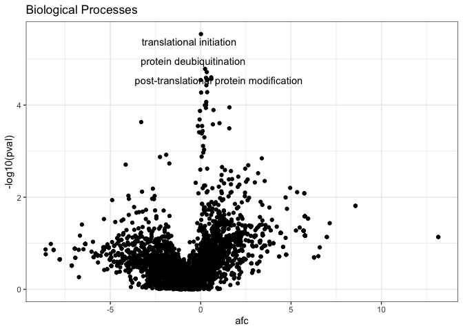

Mass Dynamics enrichment service
================

-   [Workflow example](#workflow-example)
    -   [Differential expression analysis with
        `MassExpression`](#differential-expression-analysis-with-massexpression)
    -   [Run enrichment with
        `EnrichmentAnalysisStepR`](#run-enrichment-with-enrichmentanalysisstepr)
    -   [Access enrichment results](#access-enrichment-results)
    -   [Plot enrichment volcano plot](#plot-enrichment-volcano-plot)

``` r
devtools::install_github("MassDynamics/EnrichmentAnalysisStepR")
```

``` r
library(EnrichmentAnalysisStepR)
utils::packageVersion("EnrichmentAnalysisStepR")
```

    ## [1] '0.0.21'

# Workflow example

The example runs the differential expression analysis using the [HER2
dataset](https://app.massdynamics.com/experiments/papers/c6fc6c60-fe65-47cb-bd6d-a021f0ed8720#/volcano)
(<https://pubmed.ncbi.nlm.nih.gov/26883193/>) whose data is included in
the Mass Dynamics
[MassExpression](https://github.com/MassDynamics/MassExpression) R
package. The differential expression results are then used as input for
the enrichment step.

## Differential expression analysis with `MassExpression`

``` r
library(MassExpression)
```

``` r
intensities <- mq_lfq_data$intensities
design <- mq_lfq_data$design
parameters <- mq_lfq_data$parameters
normalisation_method <- parameters[parameters[,1] == "UseNormalisationMethod",2]
species <- parameters[parameters[,1] == "Species",2]
labellingMethod <- parameters[parameters[,1] == "LabellingMethod",2]


results <- runGenericDiscovery(experimentDesign = design, 
                               proteinIntensities = intensities, 
                               normalisationMethod = normalisation_method, 
                               species = species, 
                               labellingMethod = labellingMethod)
```

    ## [1] "Sanitize import..."
    ## [1] "Starting generic discovery..."
    ## [1] "Starting pre-processing"
    ## [1] "Starting DE with limma..."
    ## [1] "Limma analysis completed. Creating output summarized experiment..."
    ## [1] "Workflow completed."

``` r
# Save results
IntensityExperiment <- results$IntensityExperiment
CompleteIntensityExperiment <-  results$CompleteIntensityExperiment
longIntensityDT <- results$longIntensityDT

saveOutput(IntensityExperiment = IntensityExperiment, 
CompleteIntensityExperiment = CompleteIntensityExperiment,
longIntensityDT = longIntensityDT, 
outputFolder =  "example_data/testDE")
```

    ## [1] "AZD8931_resistant_SKBR3_AZDRc - Parental_SKBR3"
    ## [1] "example_data/testDE"
    ## No list columns are present. Setting sep2='' otherwise quote='auto' would quote fields containing sep2.
    ## Column writers: 12 2 2 5 3 5 3 5 3 5 3 5 3 5 3 5 5 5 5 5 5 5 5 3 3 3 3 
    ## args.doRowNames=0 args.rowNames=0 doQuote=0 args.nrow=1835 args.ncol=27 eolLen=1
    ## maxLineLen=1100. Found in 0.000s
    ## Writing bom (false), yaml (0 characters) and column names (true) ... done in 0.000s
    ## Writing 1835 rows in 1 batches of 1835 rows (each buffer size 8MB, showProgress=1, nth=1)
    ## No list columns are present. Setting sep2='' otherwise quote='auto' would quote fields containing sep2.
    ## Column writers: 12 12 5 3 3 3 3 5 5 5 5 12 12 
    ## args.doRowNames=0 args.rowNames=0 doQuote=0 args.nrow=11010 args.ncol=13 eolLen=1
    ## maxLineLen=574. Found in 0.000s
    ## Writing bom (false), yaml (0 characters) and column names (true) ... done in 0.000s
    ## Writing 11010 rows in 1 batches of 11010 rows (each buffer size 8MB, showProgress=1, nth=1)

## Run enrichment with `EnrichmentAnalysisStepR`

As an example, the GMT file for Human Gene Ontologies, used in in the
Mass Dynamics enrichment service, is added to this repository in folder
`example_data/9606-Human`.

``` r
gmt_folder <- "example_data/9606-Human"
results = runEnrichmentWorkflowStep(uploadFolder = "example_data/testDE",
                                   gmtFolder = gmt_folder,
                                   outputFolder = "example_data/testEnrichment",
                                   by = "Protein",
                                   method = "camera")
```

    ## [1] "Found Discovery Data Export. Loading data"
    ## [1] "Running enrichment for comparison: AZD8931_resistant_SKBR3_AZDRc - Parental_SKBR3"
    ## [1] "example_data/9606-Human/BiologicalProcess.gmt"
    ## [1] "Sets in Library:  12401"
    ## [1] "Genes in Library:  17648"
    ## [1] "Genes in Library and dataset:  1624"
    ## [1] "Running CAMERA using native code"
    ## [1] "gene.set" "pval"     "adj.pval" "observed"
    ## [1] "gene.set" "pval"     "adj.pval" "observed" "items"    "afc"     
    ## [1] "Using set info file:  BiologicalProcess_set_info.csv"
    ## [1] "Write results for comparison: AZD8931_resistant_SKBR3_AZDRc - Parental_SKBR3"
    ## [1] "Inside for:AZD8931_resistant_SKBR3_AZDRc - Parental_SKBR3"
    ## [1] "AZD8931_resistant_SKBR3_AZDRc___Parental_SKBR3_BiologicalProcess.json"

## Access enrichment results

`results` is a list of lists containing the results. Each entry of the
`results` list contains the enrichment results for one pairwise
comparison.

-   Pairwise comparisons tested

``` r
names(results)
```

    ## [1] "AZD8931_resistant_SKBR3_AZDRc - Parental_SKBR3"

-   Gene sets tested

``` r
names(results[[1]]$libraryStatistics)
```

    ## [1] "BiologicalProcess"

-   Enrichment results for **GO Biological Processes**

``` r
head(results[[1]]$libraryStatistics$BiologicalProcess)[,c("gene.set", "afc","pval", "adj.pval", "observed", "name")]
```

    ##     gene.set         afc       pval  adj.pval observed
    ## 1 GO:0000002 -2.03259529 0.23649450 0.6791797        2
    ## 2 GO:0000012 -2.16108849 0.44123045 0.7601322        1
    ## 3 GO:0000018 -1.24869166 0.41861457 0.7435327        1
    ## 4 GO:0000027 -0.20249961 0.13004228 0.6632280       13
    ## 5 GO:0000028 -0.01337251 0.05133899 0.6435487        7
    ## 6 GO:0000038 -3.18791546 0.10808527 0.6474588        3
    ##                                           name
    ## 1             mitochondrial genome maintenance
    ## 2                   single strand break repair
    ## 3              regulation of DNA recombination
    ## 4             ribosomal large subunit assembly
    ## 5             ribosomal small subunit assembly
    ## 6 very long-chain fatty acid metabolic process

## Plot enrichment volcano plot

``` r
library(ggplot2)
library(ggrepel)
```

This results are the same obtained in the [HER2 demo
experiment](https://app.massdynamics.com/experiments/papers/c6fc6c60-fe65-47cb-bd6d-a021f0ed8720#/enrichment-analysis)
in the Mass Dynamics platform.

``` r
results_df <- results[[1]]$libraryStatistics$BiologicalProcess
ggplot(results_df, aes(x = afc, y = -log10(pval))) + geom_point() + theme_bw() +
  geom_text_repel(data = results_df[-log10(results_df$pval) > 4.7, ], aes(x = afc, y = -log10(pval), label = name)) + 
  ggtitle("Biological Processes")
```

<!-- -->
